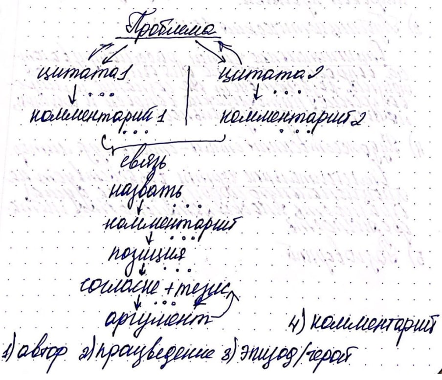

<route> { meta: { title: "Сочинение" } } </route>

# Сочинение

Минимальный объём: 150 слов.

Оптимальный объём: 200-250 слов.

Критерии:
25 из 58 первичных баллов,
42 из 100 вторичных баллов.

## План

1. Проблема -- К1:

   > Что такое настоящее искусство? Над этой проблемой размышляет ФИО в данном мне тексте

   > В данном мне тексте ФИО ставит/поднимает проблему (кого/чего?)

2. Комментарий, 3 абзаца -- К2, 6 баллов:
    1. Ввести в курс содержания текста. Очень краткий пересказ (2-3 предложения), который соотносится с проблемой.
       Цитата, помогающая раскрыть проблему, + комментарий к ней.
    2. Переход ко второму примеру: цитата + комментарий.
    3. Назвать связь примеров + её анализ по каждому примеру.

3. Позиция автора -- К3, 1 балл:

   > Таким образом, автор приходит к выводу, что...

4. Согласие с автором + аргумент + тезис -- К4, 1 балл. В отдельном абзаце.

5. Вывод:
   > Итак, мы видим, что...

## Другие критерии

К5 -- логика.

К6 -- грамматическое разнообразие и речевая точность.

К7 -- орфография:
> 0 ошибок: 3 балла,
> 1-2 ошибки: 2 балла,
> 3-4 ошибки: 1 балл,
> 5+ ошибок: 0 баллов.

К8 -- пунктуация:
> 0 ошибок: 3 балла,
> 1-2 ошибки: 2 балла,
> 3-4 ошибки: 1 балл,
> 5+ ошибок: 0 баллов.

К9 -- грамматика:
> 0 ошибок: 2 балла,
> 1-2 ошибки: 1 балл,
> 3+ ошибок: 0 баллов.

К10 -- речь:
> 0-1 ошибки: 2 балла,
> 2-3 ошибки: 1 балл,
> 4+ ошибок: 0 баллов.

К11 -- этика: 1 балл.

К12 -- фактология: 1 балл.

## Зависимость критериев

Если К1 = 0:
> К2 = 0,
> К3 = 0,
> К4 = 0.

Если К3 = 0:
> К4 = 0.

Если К10 < 2:
> К6 < 2.

## Схема

{.graph}